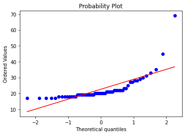
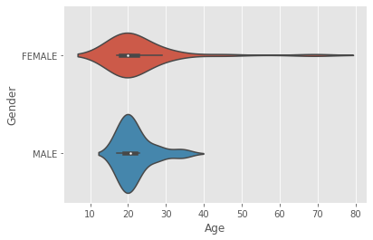
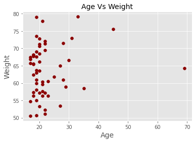
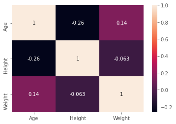

```python
#Pandas library designed for quick and easy data manipulation, reading, aggregation, visualization.
import pandas as pd
```


```python
#NumPy is used to process arrays that store values of the same datatype. 
#It facilitates math operations on arrays and their vectorization.
import numpy as np
```


```python
#OS module functions for creating and removing a directory (folder), fetching its contents, changing and identifying the current directory.
import os
```


```python
#To plot the histograms and other statiscal graphs
import matplotlib.pyplot as plt
```


```python
#To change the directory, where our class data file present.
os.chdir("F:\MS\Semester 3\Stats_with_pyhton") # or you can use cd and then path as used in linux to get change the directory
```


```python
#To get the current working directory
os.getcwd() #or you can use pwd as used in linux to get current working directory
```


    'F:\\MS\\Semester 3\\Stats_with_pyhton'


```python
#To read the file on which statiscal analysis needs to perform
ClassData = pd.read_csv('ClassData.csv')
```


```python
#Tells you what type of variable it is.
type(ClassData)
```


    pandas.core.frame.DataFrame


```python
#Description about variables contained by the dataframe
ClassData.info()
```

    <class 'pandas.core.frame.DataFrame'>
    RangeIndex: 57 entries, 0 to 56
    Data columns (total 9 columns):
     #   Column         Non-Null Count  Dtype  
    ---  ------         --------------  -----  
     0   Gender         57 non-null     object 
     1   Age            57 non-null     int64  
     2   Height         57 non-null     int64  
     3   Weight         57 non-null     float64
     4   Hair Color     57 non-null     object 
     5   Eye Color      57 non-null     object 
     6   Broken Bone    57 non-null     object 
     7   Dominant Hand  57 non-null     object 
     8   Smoke          57 non-null     object 
    dtypes: float64(1), int64(2), object(6)
    memory usage: 4.1+ KB
    


```python
# gives the total size of a dataframe by multiplying the rows with columns. 
ClassData.size
```


    513


```python
# tells how many rows and columns contained in our dataset
ClassData.shape
```


    (57, 9)


```python
# Gives you the information about the dimensions of dataset. 
ClassData.ndim
```


    2


```python
#Outputs the first five rows of the data
ClassData.head()
```


<div>
<style scoped>
    .dataframe tbody tr th:only-of-type {
        vertical-align: middle;
    }

    .dataframe tbody tr th {
        vertical-align: top;
    }

    .dataframe thead th {
        text-align: right;
    }
</style>
<table border="1" class="dataframe">
  <thead>
    <tr style="text-align: right;">
      <th></th>
      <th>Gender</th>
      <th>Age</th>
      <th>Height</th>
      <th>Weight</th>
      <th>Hair Color</th>
      <th>Eye Color</th>
      <th>Broken Bone</th>
      <th>Dominant Hand</th>
      <th>Smoke</th>
    </tr>
  </thead>
  <tbody>
    <tr>
      <th>0</th>
      <td>FEMALE</td>
      <td>69</td>
      <td>63</td>
      <td>64.295138</td>
      <td>Blonde</td>
      <td>Gray</td>
      <td>N</td>
      <td>Right</td>
      <td>N</td>
    </tr>
    <tr>
      <th>1</th>
      <td>FEMALE</td>
      <td>45</td>
      <td>63</td>
      <td>75.580959</td>
      <td>Red</td>
      <td>Blue</td>
      <td>N</td>
      <td>Right</td>
      <td>Y</td>
    </tr>
    <tr>
      <th>2</th>
      <td>FEMALE</td>
      <td>31</td>
      <td>65</td>
      <td>73.030036</td>
      <td>Blonde</td>
      <td>Gray</td>
      <td>N</td>
      <td>Right</td>
      <td>N</td>
    </tr>
    <tr>
      <th>3</th>
      <td>FEMALE</td>
      <td>30</td>
      <td>67</td>
      <td>66.597538</td>
      <td>Blonde</td>
      <td>Gray</td>
      <td>N</td>
      <td>Ambidextrous</td>
      <td>N</td>
    </tr>
    <tr>
      <th>4</th>
      <td>FEMALE</td>
      <td>29</td>
      <td>65</td>
      <td>58.991121</td>
      <td>Black</td>
      <td>Blue</td>
      <td>N</td>
      <td>Right</td>
      <td>N</td>
    </tr>
  </tbody>
</table>
</div>


```python
#Gives the list of last 10 rows in the dataset
ClassData.tail(10)
```


<div>
<style scoped>
    .dataframe tbody tr th:only-of-type {
        vertical-align: middle;
    }

    .dataframe tbody tr th {
        vertical-align: top;
    }

    .dataframe thead th {
        text-align: right;
    }
</style>
<table border="1" class="dataframe">
  <thead>
    <tr style="text-align: right;">
      <th></th>
      <th>Gender</th>
      <th>Age</th>
      <th>Height</th>
      <th>Weight</th>
      <th>Hair Color</th>
      <th>Eye Color</th>
      <th>Broken Bone</th>
      <th>Dominant Hand</th>
      <th>Smoke</th>
    </tr>
  </thead>
  <tbody>
    <tr>
      <th>47</th>
      <td>MALE</td>
      <td>19</td>
      <td>64</td>
      <td>63.681448</td>
      <td>Black</td>
      <td>Blue</td>
      <td>N</td>
      <td>Right</td>
      <td>Y</td>
    </tr>
    <tr>
      <th>48</th>
      <td>MALE</td>
      <td>19</td>
      <td>68</td>
      <td>69.102587</td>
      <td>Brown</td>
      <td>Brown</td>
      <td>N</td>
      <td>Right</td>
      <td>N</td>
    </tr>
    <tr>
      <th>49</th>
      <td>MALE</td>
      <td>19</td>
      <td>69</td>
      <td>62.943131</td>
      <td>Black</td>
      <td>Black</td>
      <td>N</td>
      <td>Right</td>
      <td>Y</td>
    </tr>
    <tr>
      <th>50</th>
      <td>MALE</td>
      <td>19</td>
      <td>67</td>
      <td>50.715015</td>
      <td>Brown</td>
      <td>Blue</td>
      <td>N</td>
      <td>Right</td>
      <td>N</td>
    </tr>
    <tr>
      <th>51</th>
      <td>MALE</td>
      <td>19</td>
      <td>67</td>
      <td>79.016093</td>
      <td>Brown</td>
      <td>Brown</td>
      <td>N</td>
      <td>Right</td>
      <td>N</td>
    </tr>
    <tr>
      <th>52</th>
      <td>MALE</td>
      <td>19</td>
      <td>67</td>
      <td>58.111115</td>
      <td>Brown</td>
      <td>Blue</td>
      <td>N</td>
      <td>Right</td>
      <td>N</td>
    </tr>
    <tr>
      <th>53</th>
      <td>MALE</td>
      <td>18</td>
      <td>65</td>
      <td>67.758466</td>
      <td>Brown</td>
      <td>Blue</td>
      <td>N</td>
      <td>Right</td>
      <td>Y</td>
    </tr>
    <tr>
      <th>54</th>
      <td>MALE</td>
      <td>17</td>
      <td>63</td>
      <td>65.677980</td>
      <td>Brown</td>
      <td>Blue</td>
      <td>N</td>
      <td>Right</td>
      <td>N</td>
    </tr>
    <tr>
      <th>55</th>
      <td>MALE</td>
      <td>17</td>
      <td>67</td>
      <td>54.786439</td>
      <td>Red</td>
      <td>Brown</td>
      <td>N</td>
      <td>Right</td>
      <td>N</td>
    </tr>
    <tr>
      <th>56</th>
      <td>MALE</td>
      <td>17</td>
      <td>65</td>
      <td>67.449053</td>
      <td>Blonde</td>
      <td>Blue</td>
      <td>N</td>
      <td>Right</td>
      <td>N</td>
    </tr>
  </tbody>
</table>
</div>


```python
#Gives the information about the headers in our dataset
ClassData.columns
```


    Index(['Gender', 'Age ', 'Height', 'Weight', 'Hair Color', 'Eye Color',
           'Broken Bone', 'Dominant Hand', 'Smoke'],
          dtype='object')


```python
#To remove the trailing space from the Age variable
ClassData.columns = ClassData.columns.str.rstrip()
ClassData.columns
```


    Index(['Gender', 'Age', 'Height', 'Weight', 'Hair Color', 'Eye Color',
           'Broken Bone', 'Dominant Hand', 'Smoke'],
          dtype='object')


```python
#Prints the values contained by gender column in ClassData dataset
ClassData["Gender"].values
```


    array(['FEMALE', 'FEMALE', 'FEMALE', 'FEMALE', 'FEMALE', 'FEMALE',
           'FEMALE', 'FEMALE', 'FEMALE', 'FEMALE', 'FEMALE', 'FEMALE',
           'FEMALE', 'FEMALE', 'FEMALE', 'FEMALE', 'FEMALE', 'FEMALE',
           'FEMALE', 'FEMALE', 'FEMALE', 'FEMALE', 'FEMALE', 'FEMALE',
           'FEMALE', 'FEMALE', 'FEMALE', 'FEMALE', 'FEMALE', 'FEMALE',
           'FEMALE', 'MALE', 'MALE', 'MALE', 'MALE', 'MALE', 'MALE', 'MALE',
           'MALE', 'MALE', 'MALE', 'MALE', 'MALE', 'MALE', 'MALE', 'MALE',
           'MALE', 'MALE', 'MALE', 'MALE', 'MALE', 'MALE', 'MALE', 'MALE',
           'MALE', 'MALE', 'MALE'], dtype=object)


```python
#prints the fist 10 rows of dataset
ClassData[0:10]
```


<div>
<style scoped>
    .dataframe tbody tr th:only-of-type {
        vertical-align: middle;
    }

    .dataframe tbody tr th {
        vertical-align: top;
    }

    .dataframe thead th {
        text-align: right;
    }
</style>
<table border="1" class="dataframe">
  <thead>
    <tr style="text-align: right;">
      <th></th>
      <th>Gender</th>
      <th>Age</th>
      <th>Height</th>
      <th>Weight</th>
      <th>Hair Color</th>
      <th>Eye Color</th>
      <th>Broken Bone</th>
      <th>Dominant Hand</th>
      <th>Smoke</th>
    </tr>
  </thead>
  <tbody>
    <tr>
      <th>0</th>
      <td>FEMALE</td>
      <td>69</td>
      <td>63</td>
      <td>64.295138</td>
      <td>Blonde</td>
      <td>Gray</td>
      <td>N</td>
      <td>Right</td>
      <td>N</td>
    </tr>
    <tr>
      <th>1</th>
      <td>FEMALE</td>
      <td>45</td>
      <td>63</td>
      <td>75.580959</td>
      <td>Red</td>
      <td>Blue</td>
      <td>N</td>
      <td>Right</td>
      <td>Y</td>
    </tr>
    <tr>
      <th>2</th>
      <td>FEMALE</td>
      <td>31</td>
      <td>65</td>
      <td>73.030036</td>
      <td>Blonde</td>
      <td>Gray</td>
      <td>N</td>
      <td>Right</td>
      <td>N</td>
    </tr>
    <tr>
      <th>3</th>
      <td>FEMALE</td>
      <td>30</td>
      <td>67</td>
      <td>66.597538</td>
      <td>Blonde</td>
      <td>Gray</td>
      <td>N</td>
      <td>Ambidextrous</td>
      <td>N</td>
    </tr>
    <tr>
      <th>4</th>
      <td>FEMALE</td>
      <td>29</td>
      <td>65</td>
      <td>58.991121</td>
      <td>Black</td>
      <td>Blue</td>
      <td>N</td>
      <td>Right</td>
      <td>N</td>
    </tr>
    <tr>
      <th>5</th>
      <td>FEMALE</td>
      <td>28</td>
      <td>67</td>
      <td>71.512345</td>
      <td>Red</td>
      <td>Brown</td>
      <td>N</td>
      <td>Right</td>
      <td>N</td>
    </tr>
    <tr>
      <th>6</th>
      <td>FEMALE</td>
      <td>25</td>
      <td>67</td>
      <td>61.879109</td>
      <td>Brown</td>
      <td>Blue</td>
      <td>N</td>
      <td>Left</td>
      <td>N</td>
    </tr>
    <tr>
      <th>7</th>
      <td>FEMALE</td>
      <td>23</td>
      <td>68</td>
      <td>60.565846</td>
      <td>Brown</td>
      <td>Blue</td>
      <td>N</td>
      <td>Right</td>
      <td>N</td>
    </tr>
    <tr>
      <th>8</th>
      <td>FEMALE</td>
      <td>22</td>
      <td>68</td>
      <td>51.156997</td>
      <td>Brown</td>
      <td>Black</td>
      <td>Y</td>
      <td>Right</td>
      <td>N</td>
    </tr>
    <tr>
      <th>9</th>
      <td>FEMALE</td>
      <td>22</td>
      <td>67</td>
      <td>69.426436</td>
      <td>Black</td>
      <td>Blue</td>
      <td>Y</td>
      <td>Ambidextrous</td>
      <td>N</td>
    </tr>
  </tbody>
</table>
</div>


```python
#prints the unique number entries contains by that particular column
pd.unique(ClassData['Hair Color'])
```


    array(['Blonde', 'Red', 'Black', 'Brown'], dtype=object)


```python
#Descriptive statistics over dataset variables contains the numeric data.
ClassData.describe()
```


<div>
<style scoped>
    .dataframe tbody tr th:only-of-type {
        vertical-align: middle;
    }

    .dataframe tbody tr th {
        vertical-align: top;
    }

    .dataframe thead th {
        text-align: right;
    }
</style>
<table border="1" class="dataframe">
  <thead>
    <tr style="text-align: right;">
      <th></th>
      <th>Age</th>
      <th>Height</th>
      <th>Weight</th>
    </tr>
  </thead>
  <tbody>
    <tr>
      <th>count</th>
      <td>57.000000</td>
      <td>57.000000</td>
      <td>57.000000</td>
    </tr>
    <tr>
      <th>mean</th>
      <td>22.596491</td>
      <td>66.263158</td>
      <td>63.708999</td>
    </tr>
    <tr>
      <th>std</th>
      <td>8.154446</td>
      <td>1.968741</td>
      <td>7.393078</td>
    </tr>
    <tr>
      <th>min</th>
      <td>17.000000</td>
      <td>61.000000</td>
      <td>50.541661</td>
    </tr>
    <tr>
      <th>25%</th>
      <td>19.000000</td>
      <td>65.000000</td>
      <td>57.647343</td>
    </tr>
    <tr>
      <th>50%</th>
      <td>20.000000</td>
      <td>67.000000</td>
      <td>63.681448</td>
    </tr>
    <tr>
      <th>75%</th>
      <td>22.000000</td>
      <td>68.000000</td>
      <td>68.518955</td>
    </tr>
    <tr>
      <th>max</th>
      <td>69.000000</td>
      <td>70.000000</td>
      <td>79.148253</td>
    </tr>
  </tbody>
</table>
</div>


```python
#prints the descriptive statistics over Age column in the dataset
ClassData['Age'].describe()
```


    count    57.000000
    mean     22.596491
    std       8.154446
    min      17.000000
    25%      19.000000
    50%      20.000000
    75%      22.000000
    max      69.000000
    Name: Age, dtype: float64


```python
#Sort the data by Age column
ClassData_sorted = ClassData.sort_values(by="Age", ascending = True)
ClassData_sorted[0:10]
```


<div>
<style scoped>
    .dataframe tbody tr th:only-of-type {
        vertical-align: middle;
    }

    .dataframe tbody tr th {
        vertical-align: top;
    }

    .dataframe thead th {
        text-align: right;
    }
</style>
<table border="1" class="dataframe">
  <thead>
    <tr style="text-align: right;">
      <th></th>
      <th>Gender</th>
      <th>Age</th>
      <th>Height</th>
      <th>Weight</th>
      <th>Hair Color</th>
      <th>Eye Color</th>
      <th>Broken Bone</th>
      <th>Dominant Hand</th>
      <th>Smoke</th>
    </tr>
  </thead>
  <tbody>
    <tr>
      <th>56</th>
      <td>MALE</td>
      <td>17</td>
      <td>65</td>
      <td>67.449053</td>
      <td>Blonde</td>
      <td>Blue</td>
      <td>N</td>
      <td>Right</td>
      <td>N</td>
    </tr>
    <tr>
      <th>54</th>
      <td>MALE</td>
      <td>17</td>
      <td>63</td>
      <td>65.677980</td>
      <td>Brown</td>
      <td>Blue</td>
      <td>N</td>
      <td>Right</td>
      <td>N</td>
    </tr>
    <tr>
      <th>30</th>
      <td>FEMALE</td>
      <td>17</td>
      <td>66</td>
      <td>50.541661</td>
      <td>Red</td>
      <td>Blue</td>
      <td>N</td>
      <td>Right</td>
      <td>N</td>
    </tr>
    <tr>
      <th>29</th>
      <td>FEMALE</td>
      <td>17</td>
      <td>67</td>
      <td>66.820207</td>
      <td>Brown</td>
      <td>Gray</td>
      <td>N</td>
      <td>Right</td>
      <td>N</td>
    </tr>
    <tr>
      <th>55</th>
      <td>MALE</td>
      <td>17</td>
      <td>67</td>
      <td>54.786439</td>
      <td>Red</td>
      <td>Brown</td>
      <td>N</td>
      <td>Right</td>
      <td>N</td>
    </tr>
    <tr>
      <th>53</th>
      <td>MALE</td>
      <td>18</td>
      <td>65</td>
      <td>67.758466</td>
      <td>Brown</td>
      <td>Blue</td>
      <td>N</td>
      <td>Right</td>
      <td>Y</td>
    </tr>
    <tr>
      <th>27</th>
      <td>FEMALE</td>
      <td>18</td>
      <td>63</td>
      <td>65.633875</td>
      <td>Brown</td>
      <td>Black</td>
      <td>N</td>
      <td>Right</td>
      <td>N</td>
    </tr>
    <tr>
      <th>26</th>
      <td>FEMALE</td>
      <td>18</td>
      <td>68</td>
      <td>68.049388</td>
      <td>Brown</td>
      <td>Brown</td>
      <td>N</td>
      <td>Right</td>
      <td>N</td>
    </tr>
    <tr>
      <th>25</th>
      <td>FEMALE</td>
      <td>18</td>
      <td>66</td>
      <td>65.505398</td>
      <td>Brown</td>
      <td>Blue</td>
      <td>N</td>
      <td>Ambidextrous</td>
      <td>N</td>
    </tr>
    <tr>
      <th>24</th>
      <td>FEMALE</td>
      <td>18</td>
      <td>67</td>
      <td>57.319703</td>
      <td>Brown</td>
      <td>Brown</td>
      <td>N</td>
      <td>Left</td>
      <td>N</td>
    </tr>
  </tbody>
</table>
</div>


```python
#To get a statistics of your choice against a particular column
print("\nCounts:", ClassData["Height"].count(),
      "\nMax:", ClassData["Height"].max(),
      "\nMin:", ClassData["Height"].min(), 
      "\nMean:", ClassData["Height"].mean(),
      "\nStd Dev.:", ClassData["Height"].std())
```

    
    Counts: 57 
    Max: 70 
    Min: 61 
    Mean: 66.26315789473684 
    Std Dev.: 1.9687406760729194
    


```python
#To group the Data by Gender
ClassData_grouped=ClassData.groupby('Gender')
```


```python
#Descriptive statistics on "Height" column splitted by gender
ClassData_grouped["Age","Height"].describe()
```

    <ipython-input-23-fa1ff5d3ca3b>:2: FutureWarning: Indexing with multiple keys (implicitly converted to a tuple of keys) will be deprecated, use a list instead.
      ClassData_grouped["Age","Height"].describe()
    


<div>
<style scoped>
    .dataframe tbody tr th:only-of-type {
        vertical-align: middle;
    }

    .dataframe tbody tr th {
        vertical-align: top;
    }

    .dataframe thead tr th {
        text-align: left;
    }

    .dataframe thead tr:last-of-type th {
        text-align: right;
    }
</style>
<table border="1" class="dataframe">
  <thead>
    <tr>
      <th></th>
      <th colspan="8" halign="left">Age</th>
      <th colspan="8" halign="left">Height</th>
    </tr>
    <tr>
      <th></th>
      <th>count</th>
      <th>mean</th>
      <th>std</th>
      <th>min</th>
      <th>25%</th>
      <th>50%</th>
      <th>75%</th>
      <th>max</th>
      <th>count</th>
      <th>mean</th>
      <th>std</th>
      <th>min</th>
      <th>25%</th>
      <th>50%</th>
      <th>75%</th>
      <th>max</th>
    </tr>
    <tr>
      <th>Gender</th>
      <th></th>
      <th></th>
      <th></th>
      <th></th>
      <th></th>
      <th></th>
      <th></th>
      <th></th>
      <th></th>
      <th></th>
      <th></th>
      <th></th>
      <th></th>
      <th></th>
      <th></th>
      <th></th>
    </tr>
  </thead>
  <tbody>
    <tr>
      <th>FEMALE</th>
      <td>31.0</td>
      <td>23.258065</td>
      <td>10.259850</td>
      <td>17.0</td>
      <td>18.0</td>
      <td>20.0</td>
      <td>22.5</td>
      <td>69.0</td>
      <td>31.0</td>
      <td>66.032258</td>
      <td>1.834555</td>
      <td>62.0</td>
      <td>65.0</td>
      <td>66.0</td>
      <td>67.0</td>
      <td>69.0</td>
    </tr>
    <tr>
      <th>MALE</th>
      <td>26.0</td>
      <td>21.807692</td>
      <td>4.630501</td>
      <td>17.0</td>
      <td>19.0</td>
      <td>20.5</td>
      <td>22.0</td>
      <td>35.0</td>
      <td>26.0</td>
      <td>66.538462</td>
      <td>2.120958</td>
      <td>61.0</td>
      <td>65.0</td>
      <td>67.0</td>
      <td>68.0</td>
      <td>70.0</td>
    </tr>
  </tbody>
</table>
</div>


```python
#To group the variables by gender and find mean for Age column accroding to both genders.
tapply=ClassData.groupby('Gender')['Age'].mean()
tapply
```


    Gender
    FEMALE    23.258065
    MALE      21.807692
    Name: Age, dtype: float64


```python
#To have a boxplot over the grouped data by Gender and specifyng the column
ClassData_grouped.boxplot(column="Age", showmeans=True)
```


    FEMALE         AxesSubplot(0.1,0.15;0.363636x0.75)
    MALE      AxesSubplot(0.536364,0.15;0.363636x0.75)
    dtype: object


    

    


```python
#To get the boxplot over continous variables that are grouped/splitted by gender
ClassData_grouped.boxplot(showmeans=True)
```


    FEMALE         AxesSubplot(0.1,0.15;0.363636x0.75)
    MALE      AxesSubplot(0.536364,0.15;0.363636x0.75)
    dtype: object


    

    


```python
#Chi-Squared Test, 
#H0: the two samples are independent.
#H1: there is a dependency between the samples.
from scipy.stats import chi2_contingency
stat, p, dof, expected = chi2_contingency(ClassData["Weight"])
print('stat=%.3f, p=%.3f' % (stat, p))
if p > 0.05:
	print('Probably independent')
else:
	print('Probably dependent')
```

    stat=0.000, p=1.000
    Probably independent
    


```python
#To check the Normality of data using Shapiro-Wilk test
#H0: the sample has a Gaussian distribution.
#H1: the sample does not have a Gaussian distribution.
from scipy.stats import shapiro
stat, p = shapiro(ClassData['Weight'])
print('stat=%.3f, p=%.3f' % (stat, p))
if p > 0.05:
	print('Probably Gaussian')
else:
	print('Probably not Gaussian')
```

    stat=0.979, p=0.428
    Probably Gaussian
    


```python
#Q-Q plot on age vairable, The “Q” in QQ-plot stands for quantile. The quantiles of a given data set are plotted against 
#the quantiles of a reference distribution, typically the standard normal distribution
stats.probplot(ClassData["Age"], plot=plt)
```


    ((array([-2.2543577 , -1.890737  , -1.6770949 , -1.52048793, -1.39421445,
             -1.28693393, -1.19271302, -1.10803605, -1.03063778, -0.95896738,
             -0.89191286, -0.82864714, -0.76853641, -0.71108263, -0.65588597,
             -0.60261932, -0.55101057, -0.50082983, -0.45188011, -0.40399034,
             -0.35701005, -0.31080516, -0.26525476, -0.22024843, -0.17568408,
             -0.13146609, -0.08750379, -0.04371004,  0.        ,  0.04371004,
              0.08750379,  0.13146609,  0.17568408,  0.22024843,  0.26525476,
              0.31080516,  0.35701005,  0.40399034,  0.45188011,  0.50082983,
              0.55101057,  0.60261932,  0.65588597,  0.71108263,  0.76853641,
              0.82864714,  0.89191286,  0.95896738,  1.03063778,  1.10803605,
              1.19271302,  1.28693393,  1.39421445,  1.52048793,  1.6770949 ,
              1.890737  ,  2.2543577 ]),
      array([17, 17, 17, 17, 17, 18, 18, 18, 18, 18, 18, 18, 18, 19, 19, 19, 19,
             19, 19, 19, 19, 19, 19, 19, 20, 20, 20, 20, 20, 20, 20, 20, 21, 21,
             21, 21, 21, 22, 22, 22, 22, 22, 22, 23, 23, 25, 27, 27, 28, 28, 29,
             30, 31, 33, 35, 45, 69], dtype=int64)),
     (6.276734143134145, 22.596491228070175, 0.7517629405401264))


    

    


```python
#To plot a hsitogram over age column
x = ClassData["Age"]
plt.style.use('ggplot')
plt.hist(x, bins=15)
#To save the plot in .svg format
plt.savefig('histo.svg')
```


    

    


```python
#Barplot over Weight Column
plt.bar(ClassData["Gender"],ClassData["Weight"])
plt.savefig('barplot.svg')
```


    

    


```python
#Violin-Plot, Violin plots are similar to box plots, 
#except that they also show the probability density of the data at different values
sns.violinplot(ClassData['Age'],ClassData['Gender']) 
```

    C:\Users\Muhammad_Numan\anaconda3\lib\site-packages\seaborn\_decorators.py:36: FutureWarning: Pass the following variables as keyword args: x, y. From version 0.12, the only valid positional argument will be `data`, and passing other arguments without an explicit keyword will result in an error or misinterpretation.
      warnings.warn(
    


    <AxesSubplot:xlabel='Age', ylabel='Gender'>


    

    


```python
#PieChart over Age column
ClassData["Age"].plot.pie(ylabel = "Age_PieChart", figsize=(10,10), autopct='%1.0f%%')
```


    <AxesSubplot:ylabel='Age_PieChart'>


    

    


```python
#Scatter Plot,a close cousin of the line plot. 
#Uses dots to represent values for two different numeric variables and used to observe relationships between variables.
plt.scatter(df_continous['Age'], df_continous['Weight'], color='darkred')
plt.title('Age Vs Weight', fontsize=14)
plt.xlabel('Age', fontsize=14)
plt.ylabel('Weight', fontsize=14)
plt.grid(True)
```


    

    


```python
import scipy
from scipy import stats
from scipy.stats import ttest_ind
from scipy.stats import t
age = ClassData["Age"]
weight = ClassData["Weight"]
```


```python
#1-sample T-test, Ho=Age of individuals is equal to or less than 20, Ha=Age of individuals is greater than 20
popmean = 20
n = 57
df = n-1
p = 0.95 # 95%; 0.05 in case of right tail
T_crit = t.ppf(p, df)
print("T_crit:", T_crit)
T_calc = scipy.stats.ttest_1samp(age, popmean, axis=0, nan_policy='propagate', alternative='two-sided')
print("T_calc:", T_calc)
```


```python
#1-sample T-test, Ho=Age of individuals is equal to or less than 20, Ha=Age of individuals is greater than 20
popmean = 20
n = 57
df = n-1
p = 0.95 # 95%; 0.05 in case of right tail
T_crit = t.ppf(p, df)
print("T_crit:", T_crit)
T_calc = scipy.stats.ttest_1samp(age, popmean, axis=0, nan_policy='propagate', alternative='two-sided')
print("T_calc:", T_calc)
```

    T_crit: 1.6725223027163505
    T_calc: Ttest_1sampResult(statistic=2.403974371017906, pvalue=0.019551960616379777)
    


```python
#Paired Sample T-test;
#This is a two-sided test for the null hypothesis that 2 related or repeated samples have identical average (expected) values.
#Ho = Related or repeated samples have identical average (expected) values
#Ha = Related or repeated samples don't have identical average (expected) values
scipy.stats.ttest_rel(age,weight, axis=0, nan_policy='propagate', alternative='two-sided')
```


    Ttest_relResult(statistic=-30.47132249962678, pvalue=1.5044572617358542e-36)


```python
#Independent Sample T-test; 
#This is a two-sided test for the null hypothesis that 2 independent samples have identical average (expected) values.
#Ho = Variances are equal, Ha = Variances are not equal
scipy.stats.ttest_ind(age, weight, axis=0, equal_var=True, nan_policy='propagate', alternative='two-sided')
```


    Ttest_indResult(statistic=-28.199736017441925, pvalue=1.0680829142198095e-52)


```python
#To find the correlation between continous variable/columns in our dataset.
df_continous = pd.DataFrame(ClassData,columns=['Age','Height','Weight'])
df_continous.corr()
```


<div>
<style scoped>
    .dataframe tbody tr th:only-of-type {
        vertical-align: middle;
    }

    .dataframe tbody tr th {
        vertical-align: top;
    }

    .dataframe thead th {
        text-align: right;
    }
</style>
<table border="1" class="dataframe">
  <thead>
    <tr style="text-align: right;">
      <th></th>
      <th>Age</th>
      <th>Height</th>
      <th>Weight</th>
    </tr>
  </thead>
  <tbody>
    <tr>
      <th>Age</th>
      <td>1.000000</td>
      <td>-0.263561</td>
      <td>0.144229</td>
    </tr>
    <tr>
      <th>Height</th>
      <td>-0.263561</td>
      <td>1.000000</td>
      <td>-0.063214</td>
    </tr>
    <tr>
      <th>Weight</th>
      <td>0.144229</td>
      <td>-0.063214</td>
      <td>1.000000</td>
    </tr>
  </tbody>
</table>
</div>


```python
#Get a Visual Representation of the Correlation Matrix in the form of heatmap using Seaborn and Matplotlib modules
import seaborn as sn
sn.heatmap(df_continous.corr(), annot=True)
```


    <AxesSubplot:>


    

    


```python

```
